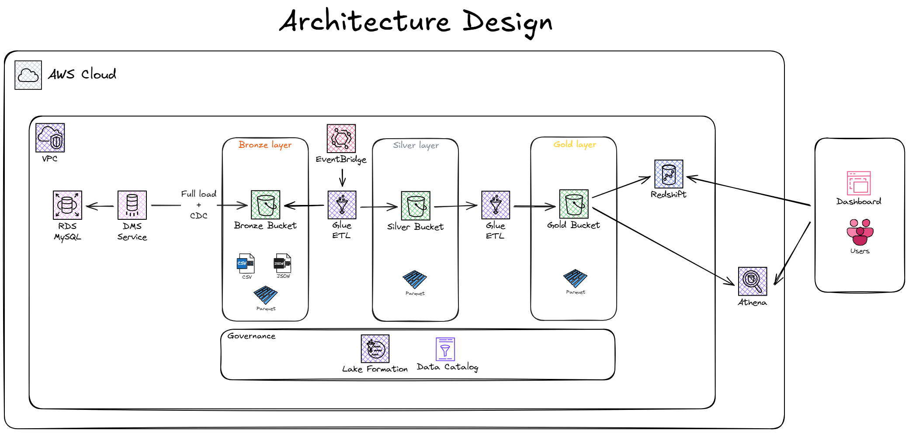

# Arquitetura AWS - Clientes

De acordo com o problema descrito, foi proposta a arquitetura abaixo, projetada para coletar, processar e disponibilizar dados de cadastro de clientes a partir de um banco MySQL utilizando a arquitetura medalhão (Bronze, Silver e Gold).

## Aprofundamento da arquitetura

A arquitetura foi criada inteiramente pensando em um ambiente AWS e tendo como pré-requisitos:

* Coleta de dados de banco MySQL utilizando CDC.
* Projeto de processamento e escrita para todos os níveis do Data Lake.
* Projeto de Governança a nível de usuário.

Dado este contexto e considerando a premissa de que o banco de dados MySQL seja uma instância RDS, foram escolhidos os seguintes componentes para compor a solução:

* **AWS Data Migration Services (DMS):** Recurso responsável pelo processo de Change Data Capture (CDC). Inicialmente, é executado um Full Load para a carga completa dos dados históricos. Após essa etapa, seguirá com a carga incremental via CDC. Os dados serão armazenados como arquivos parquet no bucket S3 da camada bronze.
* **AWS S3:** Recurso que será utilizado como camada de armazenamento para o Data Lake e estruturado de acordo com a arquitetura medalhão:
  * **Bronze layer:** Armazena dados brutos do processo de CDC e possíveis outros arquivos.
  * **Silver layer:** Contém dados tratados, normalizados e com validações de negócio aplicadas.
  * **Gold layer:** Armazena consultas analíticas, métricas e dados agregados  prontos para serem consumidos.
* **AWS EventBridge:** Serviço utilizado para o agendamento e disparo do Glue Job.
* **AWS Glue Jobs:** São os recursos responsáveis por executar o processamento dos dados com Spark entre as diferentes camadas do Data Lake.
* **AWS Glud Data Catalog:** Armazena os metadados que permite a estruturação lógica do banco de dados e schema de cada uma das tabelas e partições físicas armazenadas no S3.
* **AWS Lakeformation:** Responsável pela governança e controle de acesso de usuários a nível de banco de dados, tablas e/ou colunas.
* **AWS Redshift:** Serviço de Data Warehouse a ser utilizado como camada adicional de consumo analítico de alto desempenho para workloads pesados e de criticidade alta.
* **AWS Athena:** Recurso serverless usado para consultas ad hoc, análises exploratórias e relatórios pontuais.
